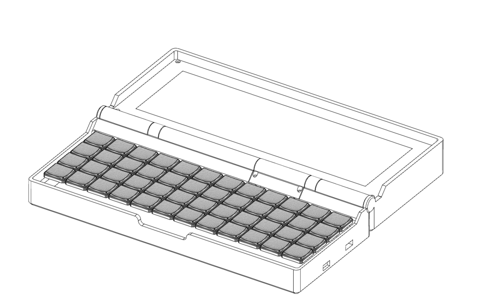
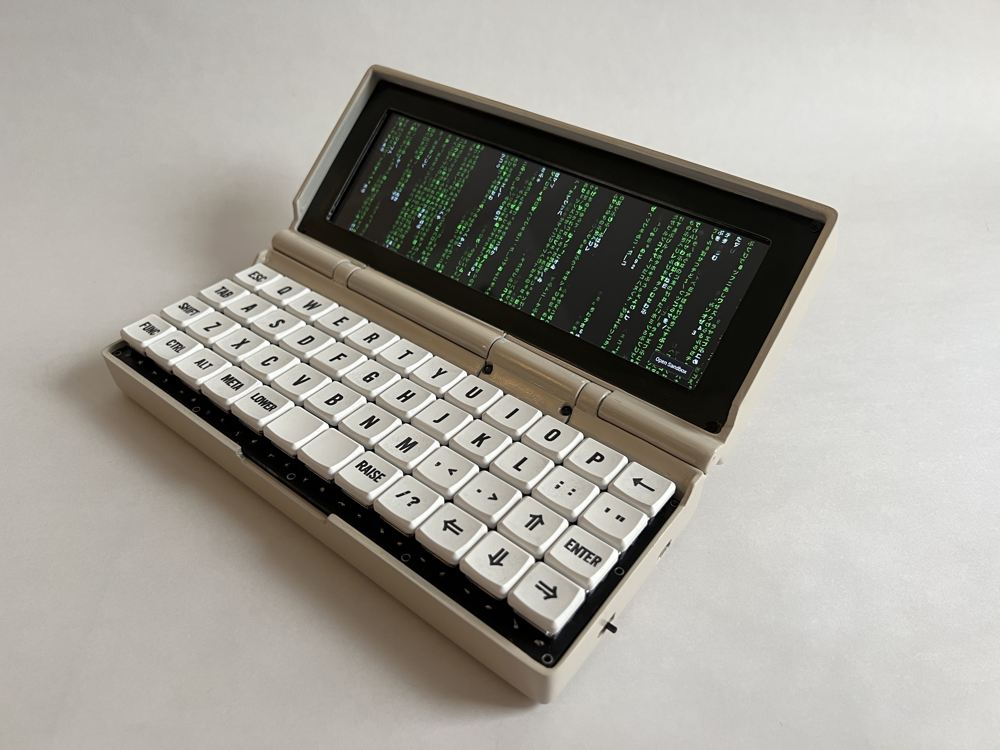
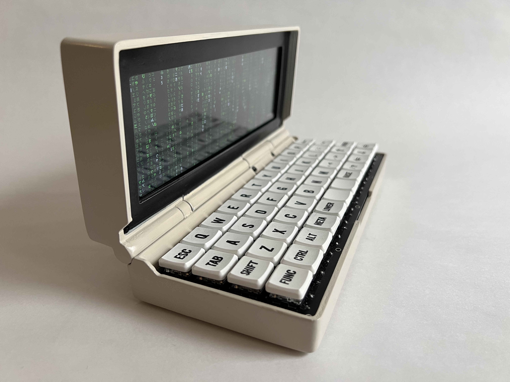
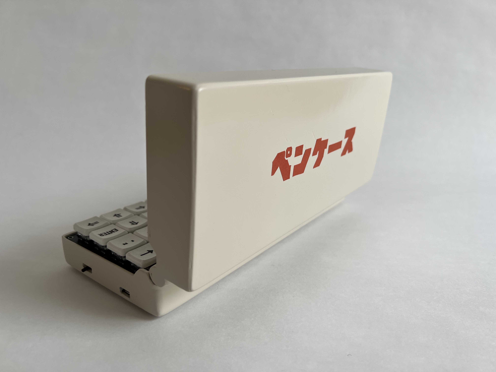
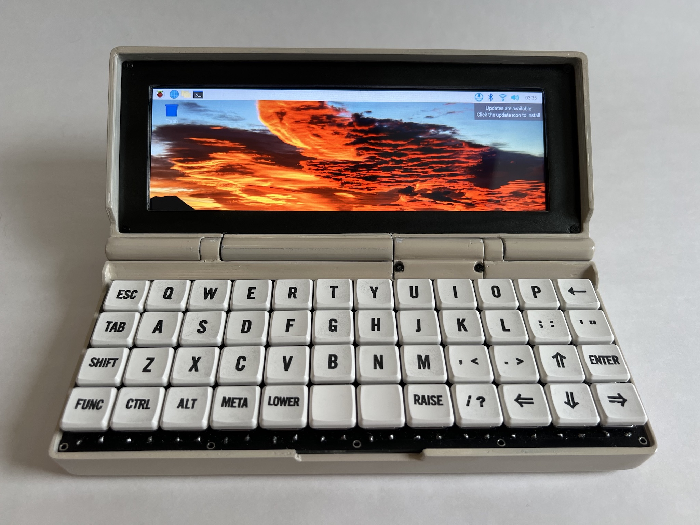
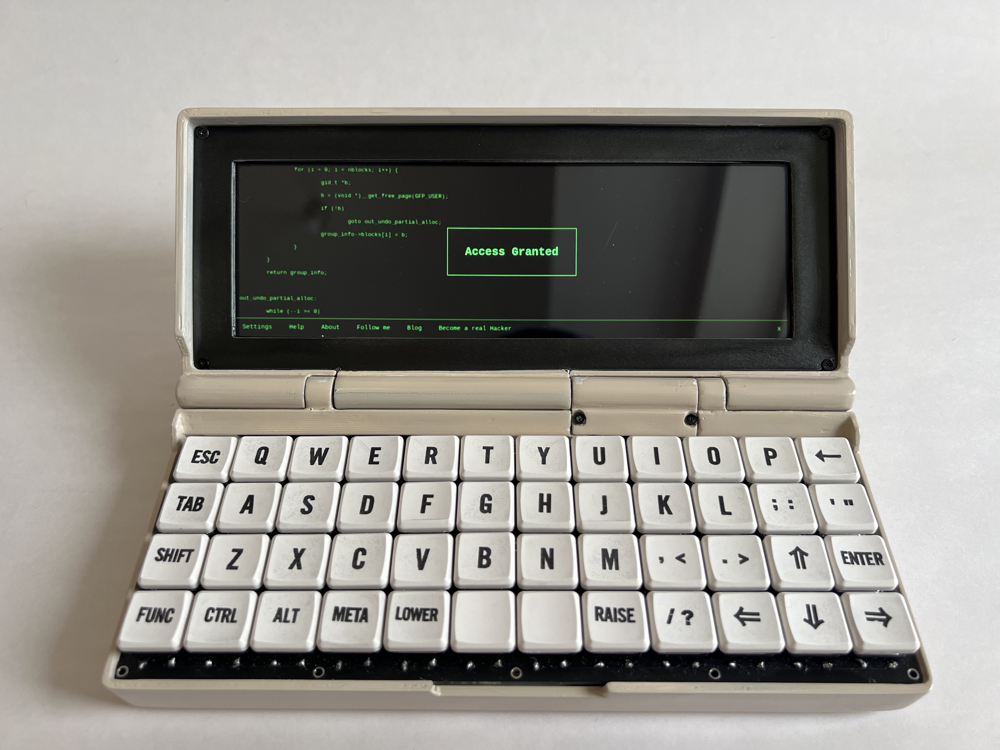
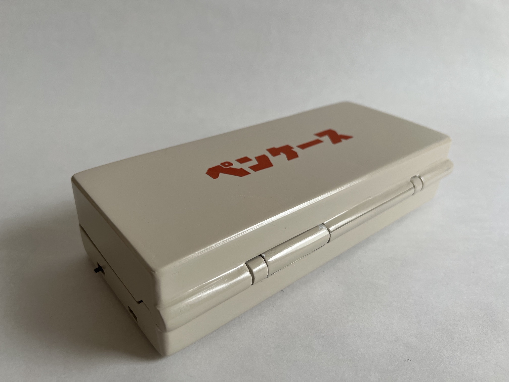
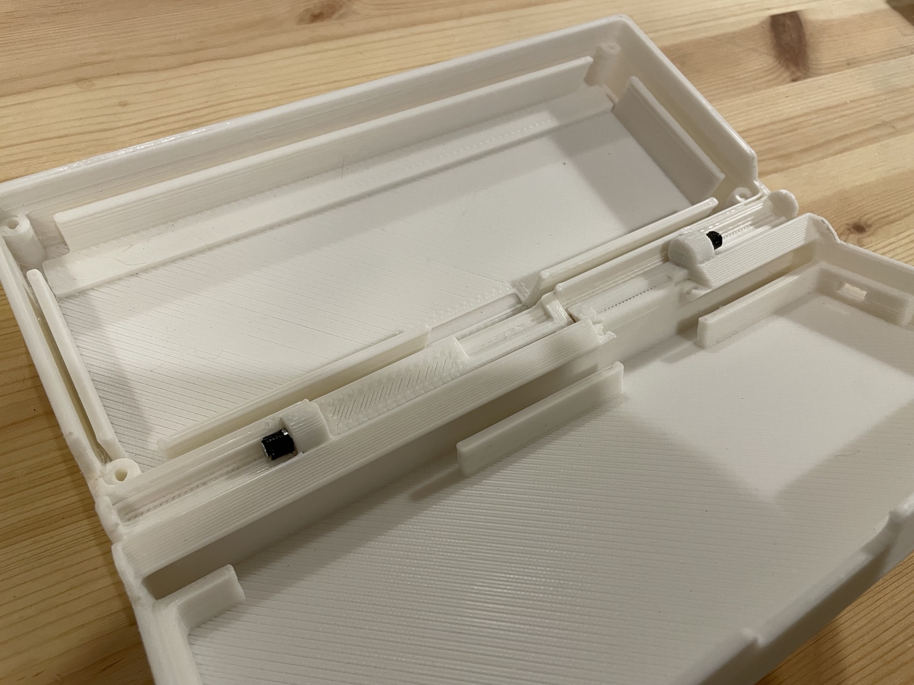
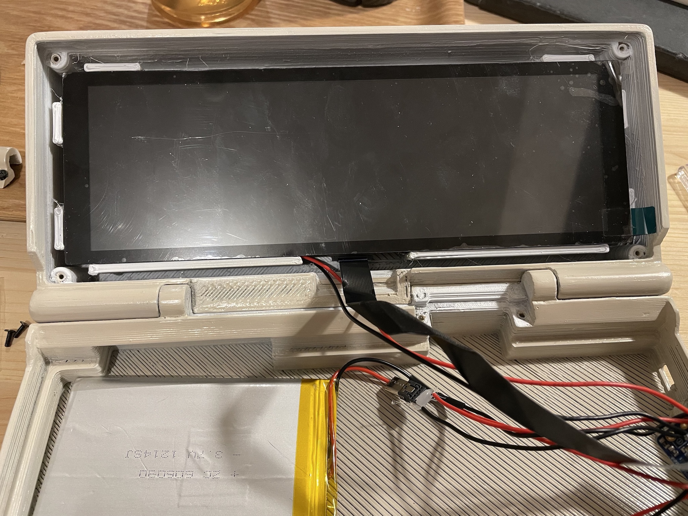

# Penkesu Computer - A Homebrew Retro-style Laptop

Penkēsu (Japanese: `ペンケース`) is a retro-style laptop powered by a Raspberry Pi Zero 2 W, a 7.9 inch widescreen display (400 x 1280 resolution), and a 48-keys ortholinear mechanical keyboard. 

## The Design 

The case of Penkesu Computer is designed around the display and keyboard to achieve a (relatively) compact physical dimensions.

Gameboy Advance SP hinges and Ribbon cable for HDMI are used to keep the hinge thin, yet holds the weight of the display so it won't tip over. 

Electronics are kept to be minimal (3 internal components) and most of the parts are either 3D printable or off-the-shelf product. 

|  |  | 
|-----------------------------|-----------------------------|
|  |  | 
|  |  | 

## Open Source Hardware 

Ever since the [CutiePi tablet](https://cutiepi.io) has been successfully funded and started shipping, I feel the need to work on a new project, something I don't need to worry too much about commercial viability, and to remind myself why I started tinkering. A "rebound" project, so to speak. 

And since there are no immediate plans on selling kits or making Penkesu Computer mass producible, I'd like to publish all the designs and plans so there's enough information for anyone interested in making one. 

## Bill of Materials 

- Display 
    - WaveShare [7.9inch Capacitive Touch Screen](https://www.waveshare.com/7.9inch-HDMI-LCD.htm)
    - Adafruit DIY HDMI Cable Parts - [Right Angle adapter](https://www.adafruit.com/product/3550), [Mini HDMI adapter](https://www.adafruit.com/product/3552), and [20cm Ribbon Cable](https://www.adafruit.com/product/3561)
- Case 
    - Gameboy Advance SP [Replacement Hinges](https://amazon.com/dp/B00YCEOXIK)
    - 3D printed parts ([STL files](stl) and [STEP file](step)) 
- Electronics 
    - Raspberry Pi [Zero 2 W](https://www.raspberrypi.com/products/raspberry-pi-zero-2-w/)
    - 3.7V 506090 (or similar size) [Li-Po battery](https://www.aliexpress.com/wholesale?SearchText=506090+battery)
    - Adafruit [PowerBoost 1000C](https://www.adafruit.com/product/2465)
- Keyboard 
    - Kailh Low Profile [Choc V1](http://www.kailh.com/en/Products/Ks/CS/319.html) Switches x 48
    - MBK Choc Low-Profile Keycaps x 48
    - 1N4148 Diode x 48 
    - Arduino Pro Micro x 1
    - PCB x 1 ([gerber file](https://github.com/larrbo/odd-rocket/blob/master/koda/koda_no%20silk.zip) and [QMK firmware](firmware))

Links are **not** affiliate links, and only provided as references. 

## The Assembly 

1. Glue two hinges to the chassis (my 3D printer is not accurate enough to print a functional hinge lock, so I simply glued them with 5 minute epoxy) 

  

2. Add heat-set threaded inserts (M2x6) to the 4 corners of screen bezel, and 2 to the hinge cover

3. Wrap the ribbon cable twice and pull it out through the hinge cover

  

4. Wiring: 

    | Component | Pin | 
    |-----------|--------|
    | battery positive | PowerBoost `Bat` pin |
    | battery negative | PowerBoost `GND` pin | 
    | switch 1 pin | PowerBoost `GND` pin | 
    | switch 2 pin | PowerBoost `EN` pin | 
    | PowerBoost `5V OUT` | display and Pi Zero's `VCC` | 
    | PowerBoost `GND` | display and Pi Zero's `GND` |

     

5. Connect keyboard's micro USB and display's mini HDMI port to Pi Zero 2 W; inset micro SD card into Pi Zero 2 W 
6. Fasten all components with M2x6 screws 

## Copyright and License

Copyright (c) 2022 Penk Chen. All rights reserved.

All files are licensed under MIT license, see the [LICENSE](LICENSE) for more information.
